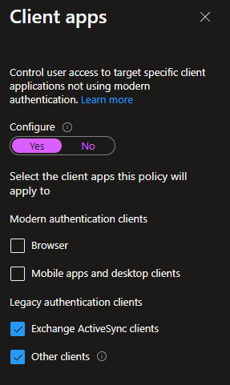

# Exchange Online: Basic Auth Depreciation

## Prerequisites/Notes:

1. Outlook must be versions 2013 or newer to be in compliance.
2. Must use Exchange Online PowerShell V2 Modules to access Exchange remotely via PowerShell going forward.
3. Must be an [Exchange Admin or higher](https://docs.microsoft.com/en-us/microsoft-365/admin/add-users/about-admin-roles?view=o365-worldwide) to make these changes.
4. MFA enabled
5. Modern Authentication must be enabled.
6. Conditional Access Policies can take up 24 hours to take effect.

## Background:

In early 2019 MS announced retirement for Basic Auth for Legacy protocols. (MAPI,RPC, (OAB) Offline Address Book, (EWS) Exchange Web Services, POP, IMAP,(EAS)Exchange ActiveSync, and Remote PowerShell) but not for SMTPAUTH.

Starting October 1st, 2022 MS will start randomly turning off Basic Auth for the above protocols. They state they will also notify the Tenancy a week ahead as well as on the day via the [ServiceHealth Dashboard](https://admin.microsoft.com/AdminPortal/home#/servicehealth). MS also stated they will allow post October 1st, 2020 a onetime re-enablement. You also can pre-opt out of having a proto disabled if you do so before October 1st, 2022, but once 2023 rolls around you will no longer be able to re-enable or opt-out again.

If you have already blocked Basic Auth Proto dependencies then you have nothing left to do. If you are not sure, check your "Monthly Usage Reports" in the [Message Center](https://admin.microsoft.com/AdminPortal/home#/MessageCenter).

Search for "Basic Auth"

 

 

This section will let you know what you need to change.

Anything with a number grater then 0 will need addressed.

## Objective:

1. Enable MFA, Enabled Modern Auth, and all Basic Auth protocols are disabled/blocked ASAP.

## Make sure Modern Auth is Enabled

1. In the [MAC (Microsoft Admin Center)](https://admin.microsoft.com/#/Settings/Services/:/Settings/L1/ModernAuthentication) go to Settings > Org Settings,

   and search for "Modern Auth.

2. Then click on it and make sure "Turn on modern auth" is enabled. You may also have basic auth already disabled. As the tan box states, make sure before disabling Modern Auth on a proto, that it is not being used. Refer to the "Basic Auth Monthly Report" above. These will need turned off sooner than later.

## Enable Basic Auth (Not Recommended EOL 2023)

1. In the [MAC (Microsoft Admin Center) home page](https://admin.microsoft.com/#/homepage), click on "Help and Support" in the lower left.

4. Search for "Basic Auth Enable".

5. Then run the test,

6. Then pick the proto you wish to enable.

## Disable/Block Basic Auth

1. First lets double check to make sure users are not still using some Basic Auth methods. [In Azure A/D](https://portal.azure.com/#view/Microsoft_AAD_IAM/ActiveDirectoryMenuBlade/~/Overview), go to "All Services",

    Under the "Identity" section, click "Users"

    Then under the "Activity" section, click "Sign-in Logs"

2. On the "Add Filters" button, select "Client App".

3. Then on the new Colum filter check Exchange ActiveSync, Exchange Online PowerShell,
   Exchange Web Service, IMAP, and POP.

4. Unfortunately you will need to open each Login type and view its protocol. Comb through to
   make sure no actual users are using Basic Auth.

5. Now that we have double checked ourselves, lets create a Conditional Access Policy to block Basic Auth methods for Cloud apps. On the [Azure A/D homepage](https://portal.azure.com/#view/Microsoft_AAD_IAM/ActiveDirectoryMenuBlade/~/Overview), go to the "Security" button.

    Click on the "Conditional Access" button

    And then click on the "New Policy" tab.

6. Under the "Name" pulldown let's call it "Basic Auth Block".

   
7. On the"Assignment" pulldown, select "Users and Groups", then pick "All Users".

   
8. Then on the "Cloud Apps or Actions" pulldown, pick Cloud apps.

9. Under the "Conditions" pull down, select "Client Apps". We have two ways of setting
   this up. Indirectly blocking Basic Auth or Directly blocking Basic Auth.

*Directly blocking Basic Auth:* This is if you know you don’t have anything using Basic Auth, that you should have confirmed above. A side note when checking "Other Clients", this blocks "Exchange Online PowerShell" and "Dynamics 365" using Basic Auth as well as older devices that do not support MFA.

Slide the "Configure" button to "Yes" and make sure "Exchange Active Sync Clients" and "Other Clients" are the only ones checked.

_**Indirectly blocking Basic Auth:**_ This is if you know you have legacy devices that still require Basic Auth aka don’t support MFA and you want to not block it. Not shaming here but this is considered "Technical Debt" and should be addressed sooner than later. Keep the Slider set to "No".

10. On "Access Control" select "Block Access" as we are trying to block Basic Auth and leave "Require all the selected Controls" as default.

11. Then don’t select anything for "Session Control".
13. Now make sure you create your Conditional Access Policy as a "Report only" and review it with the What if Tool" before turning it on. There is also a new feature on excluding the person who created the "Conditional Access Policy" Keep in mind what option you make. Report only will not take effect until its changed to "On".

_**"What If" tool to test a Conditional Access Policy**_

1. Now that our "Block Basic Auth Conditional Access Policy" is in read only mode, let see how it effects a user. First click on the "What If" button. (Azure A/D Home > Security > Conditional Access > What If)

2. Then under the "Users and Workload Identities" section select "Users" and pick a user you know will be effected in your Org.

3. On the "Cloud Apps, Actions, or Authentication Context" section, make sure the pull down is set to "Cloud Apps" and select "Any Cloud App" and leave the other sections blank.

Depending on how you blocked Basic Auth you can also check one or multiple Apps specifically.

4. Now press the "What If" button,

You should now see our Conditional Access Policy blocking Basic Auth.

If your Policy is showing under "Policies that don’t Apply" go back over the Disable/Block Basic Auth section again.

If you are new to Conditional Access or What If, I encourage you to create a fake Org User and External User to test signing in to Apps in various ways when thePolicy is turned on post What If testing to see how things act by signing in as them.

## Links

1. Basic Auth depreciation:
   [https://techcommunity.microsoft.com/t5/exchange-team-blog/basic-authentication-deprecation-in-exchange-online-september/ba-p/3609437](https://techcommunity.microsoft.com/t5/exchange-team-blog/basic-authentication-deprecation-in-exchange-online-september/ba-p/3609437)

   [https://docs.microsoft.com/en-us/exchange/clients-and-mobile-in-exchange-online/deprecation-of-basic-authentication-exchange-online?WT.mc_id=365AdminCSH_SupportCentral](https://docs.microsoft.com/en-us/exchange/clients-and-mobile-in-exchange-online/deprecation-of-basic-authentication-exchange-online?WT.mc_id=365AdminCSH_SupportCentral)
2. MAC Home Page:

   [https://admin.microsoft.com/#/homepage](https://admin.microsoft.com/#/homepage)
3. MAC Service Health Dashboard:

   [https://admin.microsoft.com/AdminPortal/home#/servicehealth](https://admin.microsoft.com/AdminPortal/home#/servicehealth)
4. MAC Message Center :
   [https://admin.microsoft.com/AdminPortal/home#/MessageCenter](https://admin.microsoft.com/AdminPortal/home#/MessageCenter)
5. Disable/Enable Basic Auth in Exchange Online :
   [https://docs.microsoft.com/en-us/exchange/clients-and-mobile-in-exchange-online/disable-basic-authentication-in-exchange-online](https://docs.microsoft.com/en-us/exchange/clients-and-mobile-in-exchange-online/disable-basic-authentication-in-exchange-online)

   [https://docs.microsoft.com/en-us/exchange/clients-and-mobile-in-exchange-online/authenticated-client-smtp-submission](https://docs.microsoft.com/en-us/exchange/clients-and-mobile-in-exchange-online/authenticated-client-smtp-submission)

   [https://docs.microsoft.com/en-us/azure/active-directory/conditional-access/block-legacy-authentication](https://docs.microsoft.com/en-us/azure/active-directory/conditional-access/block-legacy-authentication)
6. PowerShell Remoting V2 Module:
   [https://docs.microsoft.com/en-us/powershell/exchange/connect-to-exchange-online-powershell?view=exchange-ps](https://docs.microsoft.com/en-us/powershell/exchange/connect-to-exchange-online-powershell?view=exchange-ps)
7. MAC Admin Roles:
   [https://docs.microsoft.com/en-us/microsoft-365/admin/add-users/about-admin-roles?view=o365-worldwide](https://docs.microsoft.com/en-us/microsoft-365/admin/add-users/about-admin-roles?view=o365-worldwide)
8. Azure A/D Portal:
   [https://portal.azure.com/#view/Microsoft_AAD_IAM/ActiveDirectoryMenuBlade/~/Overview](https://portal.azure.com/#view/Microsoft_AAD_IAM/ActiveDirectoryMenuBlade/~/Overview)
