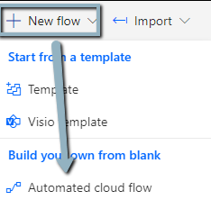
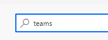
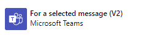
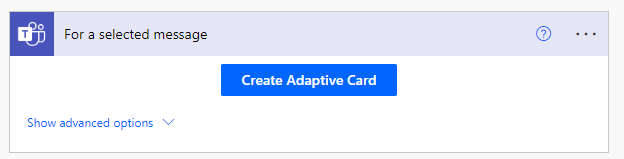
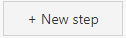
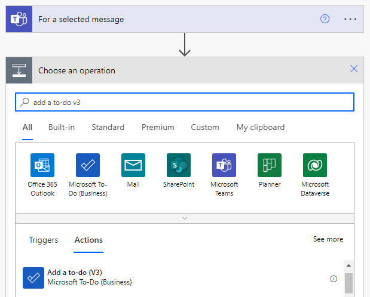
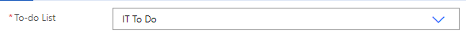

# Teams Chat MSG to To-Do List

## Prerequisites/Notes

1. Power Automate Free or better.

## Objective:

1. The ability to save a Teams MSG and place it into a a To-Do list.

2. Then click on "New Flow"

3. Click "Skip" if asked.

4. Then in the search, type "Teams" 

    and select "For a Selected Message"

    and leave it as default.

5. Then click add new step and type "Add a to-do v3"

6. On the "To-Do-List" select the list you wish to add this chat MSG to.

7. In the "Title" I like to  

## Header 1

1. Go to your Power Automate "My Flows" tab.

## Links

1. zzz
