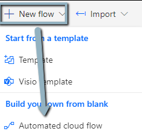

# Teams Chat MSG to To-Do List

## Prerequisites/Notes

1. Power Automate Free or better.

## Objective:

1. The ability to save a Teams MSG and place it into a a To-Do list.

2. Then click on "New Flow"

3. Click "Skip" if asked.

## Header 1

1. Go to your Power Automate "My Flows" tab.

## Links

1. zzz
