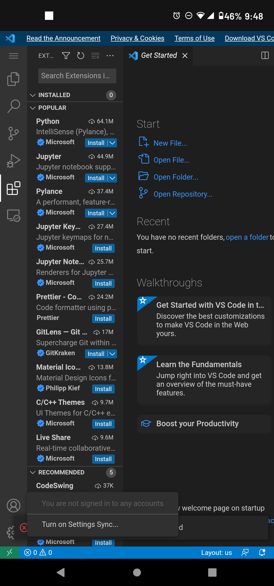

# Useing VS Code on Mobile

You can use VS Code on your mobile device or even in the browser.

## Steps:

1. Go to VSCode.dev
2. You can start writng. You can also log in w/ your GitHub or MS Acct to Sync Extentions.

   
3. Not all extentions can be used on mobile, so some cureature comferutres will be missing.

   

   

   4. Don't forget to create a shortcut!

   

## Links:

1. VSCode.dev
